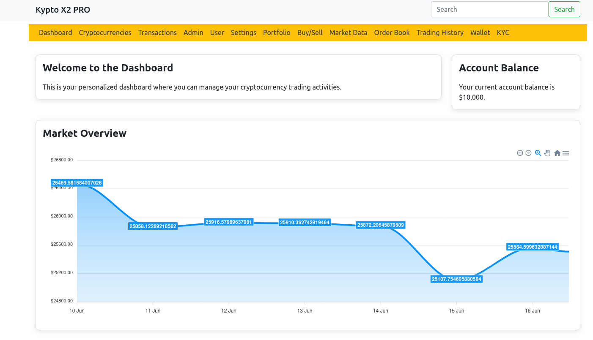
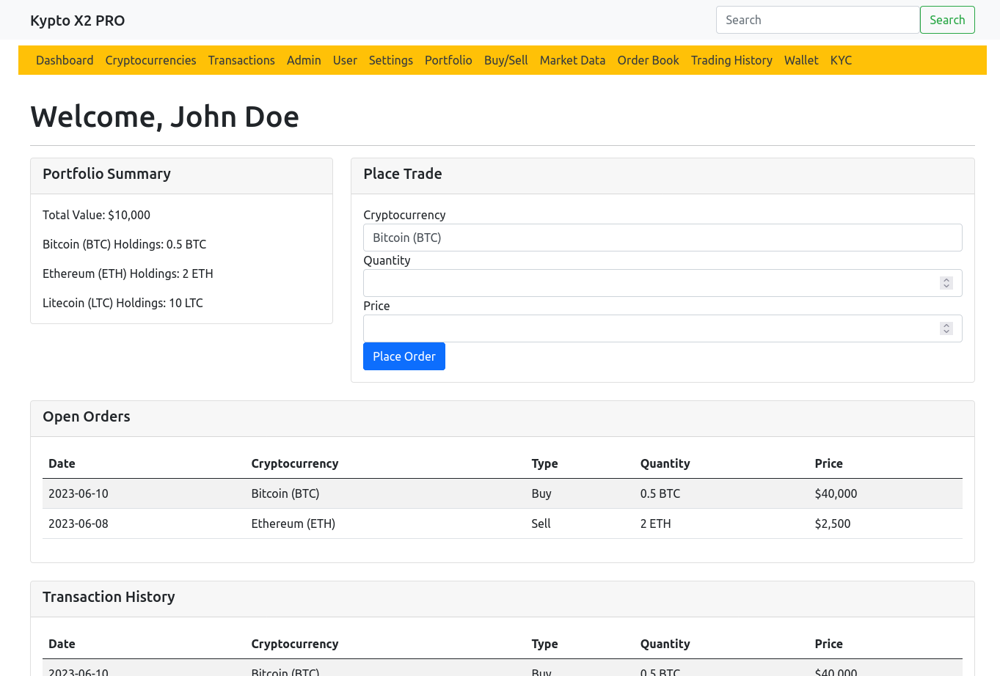
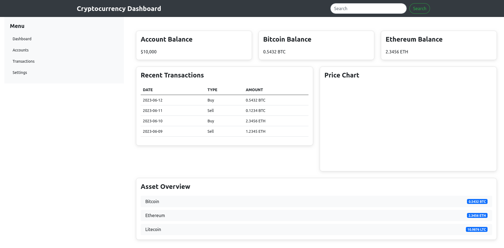
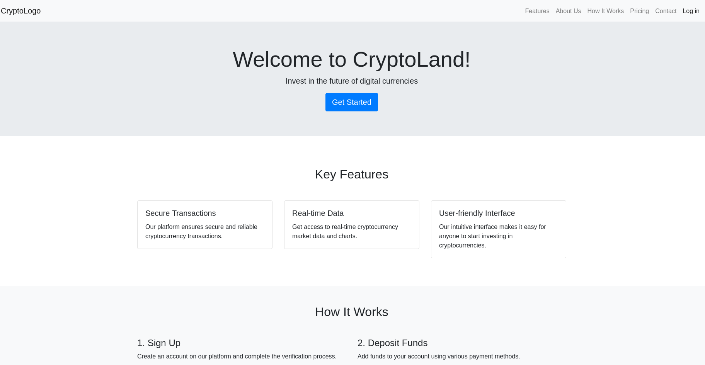

<h1>Cypto Website</h1>

Contributing

Contributions are welcome! If you find any issues or have suggestions for improvements, please follow these guidelines:

1. Fork the repository: Click on the "Fork" button on the project's GitHub page to create a fork in your own GitHub account.
2. Create a new branch: Switch to a new branch where you'll make your changes using git checkout -b branch-name.
3. Make your modifications: Implement your changes, fix bugs, or add new features.
4. Test your changes: Ensure that your changes do not introduce any regressions and that the project builds successfully.
5. Commit and push: Commit your changes and push them to your forked repository.
6. Open a pull request: Go to the original repository and open a pull request, describing your changes and why they should be merged.

